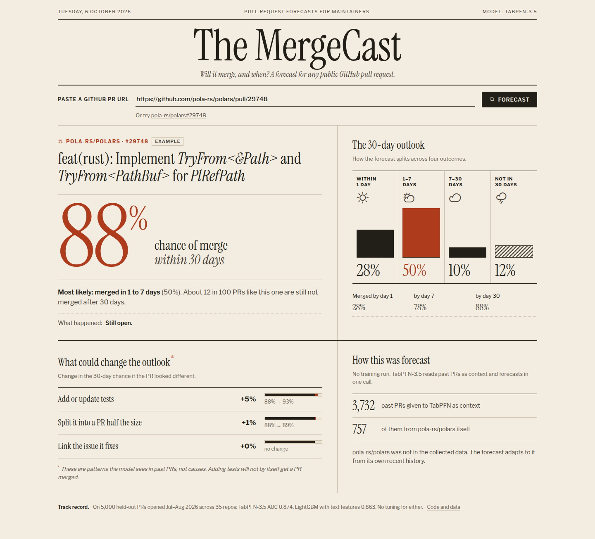
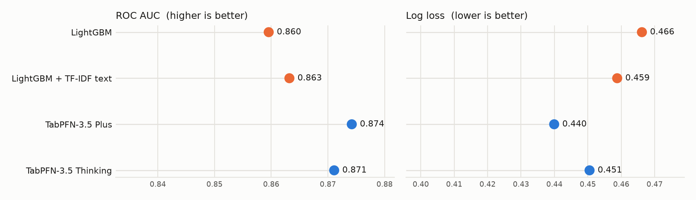
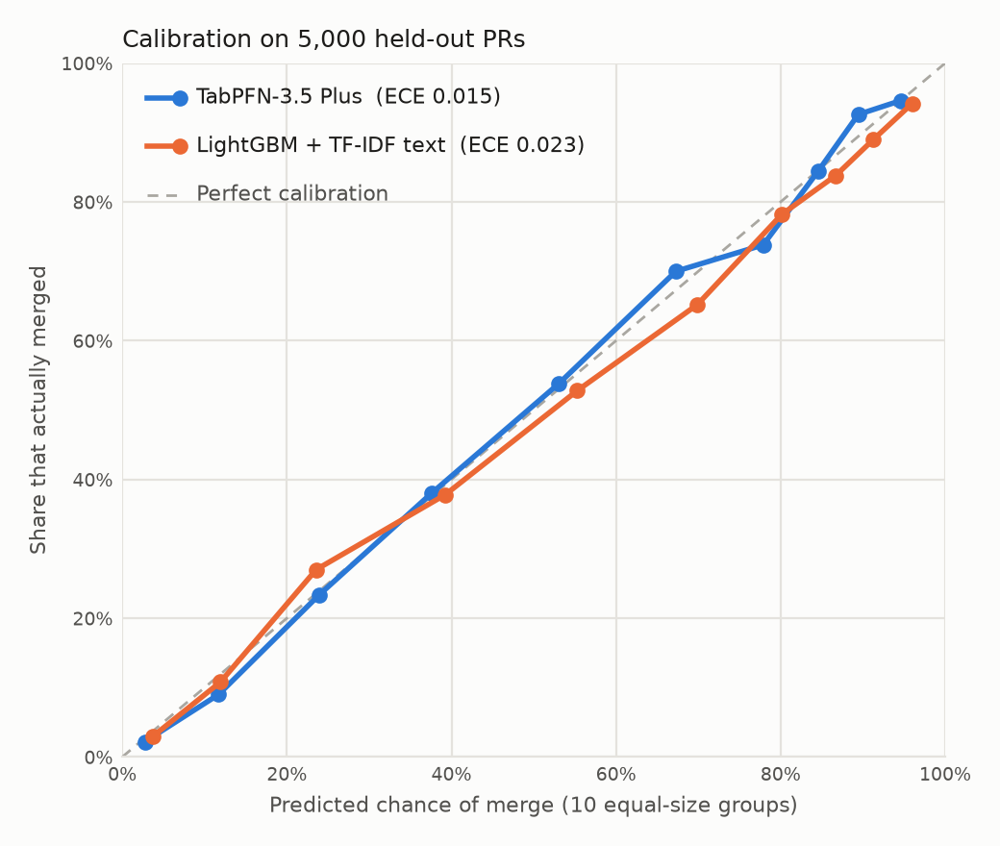
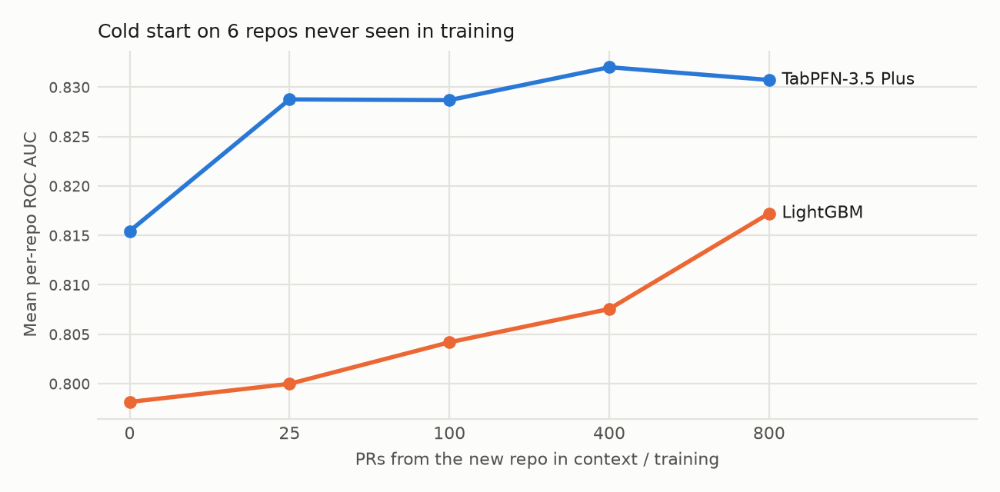
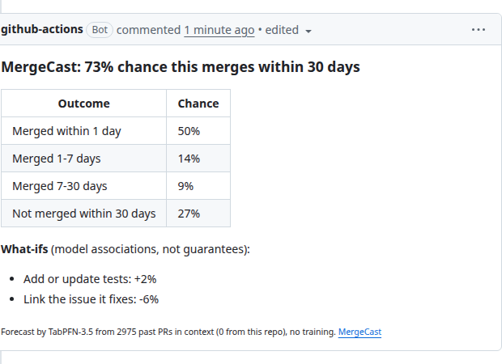

# MergeCast

**Will this pull request get merged, and when?** MergeCast forecasts it for any
public GitHub PR, using TabPFN-3.5 and nothing else: no model is trained ahead of
time. Each forecast puts a few thousand past PRs, including the target repo's
own recent history, into TabPFN-3.5's context and predicts in one call.

```
$ uv run mergecast https://github.com/pola-rs/polars/pull/29748

pola-rs/polars#29748  feat(rust): Implement `TryFrom<&Path>` and `TryFrom<PathBuf>` for `PlRefPath`
context: 3732 PRs, 757 from this repo (repo not in training data)

Chance it merges within 30 days: 86%

          within 1 day  ████████······················  25%
              1-7 days  ████████████████··············  52%
             7-30 days  ███···························  9%
    not within 30 days  ████··························  14%

What-ifs (model associations, not guarantees):
   +3%  Add or update tests
   +2%  Split it into a PR half the size
   +0%  Link the issue it fixes
```

**Try it live: [mergecast.onrender.com](https://mergecast.onrender.com)**. Paste any public PR
URL. A fresh forecast takes about a minute; the first visit after a quiet spell
can take another ~50 seconds while the free server wakes up.

Built for the [Prior Labs TabPFN-3.5 Hackathon](https://platform.priorlabs.ai/hackathon-3.5).



## Results

All numbers come from a time split: models learn from PRs opened March to June
2026 and are tested on 5,000 PRs opened in July and August 2026, across 35
repos (29,717 training rows). Nothing was tuned for any model.

**Will it merge within 30 days?**

| Model | ROC AUC | Log loss | Brier |
|---|---|---|---|
| LightGBM | 0.860 | 0.466 | 0.151 |
| LightGBM + TF-IDF text | 0.863 | 0.459 | 0.149 |
| **TabPFN-3.5 Plus** | **0.874** | **0.440** | **0.142** |
| TabPFN-3.5 Thinking (`group_col="repo"`) | 0.871 | 0.451 | 0.145 |



**How sure are we?** We resampled the 5,000 test PRs 2,000 times (paired, so
every model sees the same resample) to get 95% ranges:

| Model | ROC AUC (95% range) | Log loss (95% range) |
|---|---|---|
| LightGBM | 0.860 (0.849-0.870) | 0.466 (0.449-0.483) |
| LightGBM + TF-IDF text | 0.863 (0.853-0.874) | 0.459 (0.442-0.476) |
| **TabPFN-3.5 Plus** | **0.874 (0.864-0.884)** | **0.440 (0.425-0.455)** |
| TabPFN-3.5 Thinking | 0.871 (0.861-0.881) | 0.451 (0.433-0.470) |

The ranges overlap, but the paired comparison is what counts: Plus beats
LightGBM + text by +0.011 AUC (95% range +0.007 to +0.015) and has lower log
loss in every one of the 2,000 resamples.

**Can you trust the percentages?** When TabPFN-3.5 says 70%, about 70% of
those PRs merge. Its average calibration error (ECE) is 0.015, against 0.023
for LightGBM + text and 0.030 for Thinking.



**When will it merge?** (4 outcomes: within 1 day / 1-7 days / 7-30 days / not
within 30 days)

| Model | Log loss | Accuracy |
|---|---|---|
| Base rate | 1.222 | |
| LightGBM | 0.948 | 62.8% |
| **TabPFN-3.5 Plus** | **0.892** | **65.3%** |

**A repo it has never seen.** Six repos (cpython, next.js, kubernetes, ollama,
grafana, ruff) are removed from the data. Each model then gets 0 to 800 of that
repo's older PRs and is scored on 400 of its newer ones. The chart shows the
mean AUC within each repo.

| PRs from the new repo | 0 | 25 | 100 | 400 | 800 |
|---|---|---|---|---|---|
| LightGBM (retrained each time) | 0.798 | 0.800 | 0.804 | 0.808 | 0.817 |
| **TabPFN-3.5 Plus (in context, no training)** | **0.815** | **0.829** | **0.829** | **0.832** | **0.831** |



TabPFN-3.5 is ahead at every step and is already better with zero PRs from the
new repo than LightGBM is with 800. Most of its gain comes from the first 25
PRs; more history adds little after that.


What we found, plainly:

- TabPFN-3.5 Plus beats a LightGBM baseline that also gets the text (as TF-IDF)
  on every metric, with no tuning and no training step.
- Thinking mode did not beat Plus here (AUC 0.871 vs 0.874). Our guess is that
  the gain from grouping by repo is already captured by the `repo` column and
  the repo history features.
- Text helps, but only a little: Plus with text columns scores AUC 0.872, and
  0.870 without them (30K/5K run). Most of the signal in titles and
  descriptions is probably already in features pulled from them
  (`title_prefix`, `links_issue`, `body_len`).


## Why this is a TabPFN problem

A PR is a messy, mixed row: free text (title, description, file paths), counts
(lines changed, files touched), categories (repo, author role, title prefix
like `fix:` or `[BUG]`), and history (how this repo and this author have done
lately). Every repo has its own culture. cpython merges 73% of PRs within 30
days; open-webui merges 25%. A model has to handle all of that at once, and it
has to adapt to repos it has never seen.

TabPFN-3.5 covers each part:

| Need | TabPFN-3.5 feature used |
|---|---|
| Titles, descriptions and file paths are the strongest signal | Native text columns (Plus) |
| PRs cluster by repo and arrive over time | Thinking mode with `group_col="repo"`, `group_time_col="created_ts"` |
| A brand new repo must work on day one | In-context learning: put the repo's recent PRs in the context, no retraining |
| "When", not just "if" | 4-way outcome (merged within 1 day / 1-7 days / 7-30 days / not in 30 days) from one call |
| "What would help?" | What-if rows scored in the same call as the real PR |

## Data

45,142 PRs (bots removed) from 35 active open source repos, opened between
March and August 2026, collected with the GitHub GraphQL API. Each repo is
sampled evenly over time (up to 150 PRs per half-month), so busy repos don't
drown out the rest, and every PR is old enough that its 30-day outcome is known.

Every feature describes the PR **as it looked when it was opened**, or the
repo and author **as they looked before that moment**. Two leaks were found
and removed along the way:

- GitHub's `authorAssociation` is reported as of *today*, and a merged PR turns
  its author into a `CONTRIBUTOR`. Kept as-is it gave away the label (authors
  marked `NONE` had a 0.6% merge rate). Only the stable maintainer roles
  (OWNER, MEMBER, COLLABORATOR) are kept; everyone else is `EXTERNAL`.
- The repo's recent merge rate only counts PRs opened 30-60 days earlier,
  whose outcomes are all settled. Counting newer PRs would include only those
  that already merged and inflate the rate.

Known limits: additions, deletions and changed files are the PR's final
values, not the values at opening (GitHub doesn't keep the history cheaply).
What-ifs are associations learned from data, not causal effects.

The feature table ships in the repo as `data/prs.parquet`.

## Run it

```bash
git clone https://github.com/Sarcastic-Soul/mergecast && cd mergecast
echo "TABPFN_TOKEN=<your Prior Labs API key>" > .env   # free key at platform.priorlabs.ai
gh auth login        # or set GITHUB_TOKEN

uv run mergecast <PR URL>          # terminal forecast
uv run mergecast-web               # web demo at http://localhost:8000 (--port to change)
```

### Deploy your own web demo

`render.yaml` deploys the demo to Render's free plan (512MB is enough: the
server reads one repo's rows at a time instead of loading the whole table).
Create a Blueprint from this repo and fill in `TABPFN_TOKEN` and a read-only
`GITHUB_TOKEN`. Forecasts are cached per PR for 6 hours, and
`MERGECAST_DAILY_CAP` / `MERGECAST_PER_VISITOR` limit how many fresh forecasts
the public can run on your key.

### As a GitHub Action

Add your Prior Labs key as the `TABPFN_TOKEN` repository secret and copy
[`.github/workflows/example.yml`](.github/workflows/example.yml) into your repo.
Each new PR gets a forecast comment, which is updated in place if the
workflow runs again. Here it is on a real PR in a small test repo,
[mergecast-demo#3](https://github.com/Sarcastic-Soul/mergecast-demo/pull/3):



The demo repo has no past PRs, so TabPFN-3.5 relies on PRs from the 35
other repos in its context. What-ifs the PR already does (it
already has tests, already links an issue, or is too small to split) are left out.

### Reproduce the results

```bash
uv run scripts/collect.py                 # ~45 min, GitHub GraphQL (optional, data ships in the repo)
uv run scripts/prepare.py                 # raw PRs -> data/prs.parquet
uv run scripts/evaluate.py --models lgbm lgbm_text plus thinking --max-train 60000 --max-test 5000
uv run scripts/experiments.py coldstart text timing
uv run scripts/stats.py                   # bootstrap ranges + calibration, no API tokens
uv run scripts/charts.py
```

TabPFN results are cached in `data/preds/`, so re-runs don't spend API tokens.

## Layout

```
mergecast/features.py   features, shared by training and live scoring
mergecast/github.py     live PR + repo history fetch (same sampling as training)
mergecast/predict.py    in-context forecast + what-ifs
mergecast/cli.py        `mergecast` command, also used by the Action
mergecast/server.py     web demo (FastAPI, streams progress)
scripts/                collect, prepare, evaluate, experiments, charts
```

## License

Code: Apache-2.0. TabPFN-3.5 is used through the Prior Labs API under its own terms.
